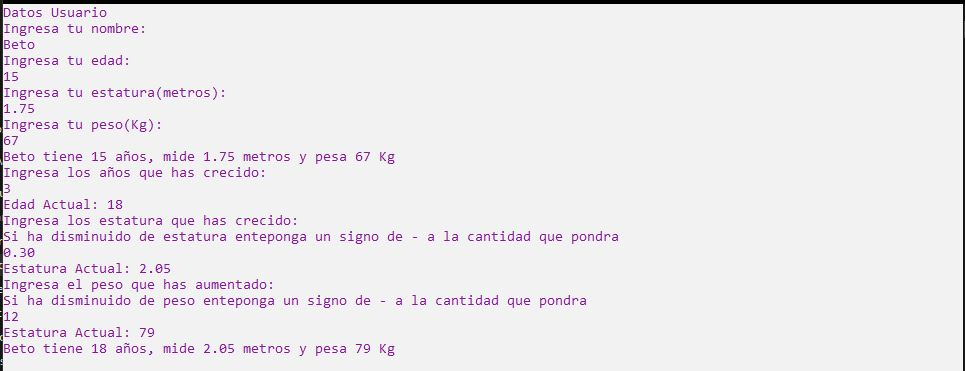

# Ejercicio 10

Realiza una clase llamada "Persona"que tenga los atributos: nombre edad, estatura(metros)
y peso(Kg). El usuario ingresará los datos dichos datos. Crea algunos métodos (mínimo 3) y
mandalos llamar en una clase principal.

Ejecución
--------------

