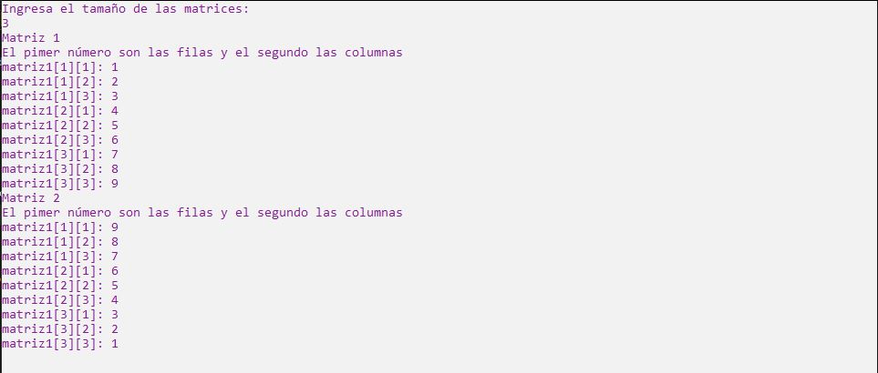
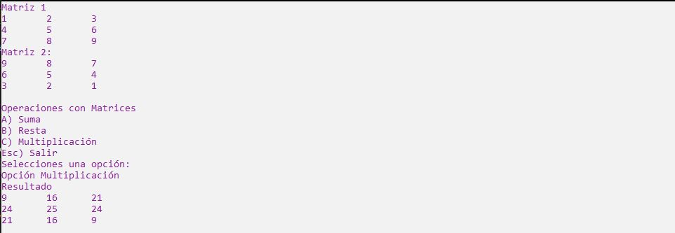

# Ejercicio 11

Elabora un programa que simule una calculadora de matrices (utilizando arreglos bidimensionales). El tamaño de la matriz (arreglo) deberá ser ingresado por el usuario, así como los valores
contenidos en ella. En este caso sólo se soportarán matrices cuadradas (nxn). Las operaciones
que deberá contender la calculadora son:
* suma
* resta
* multiplicación

Se puede utilizar cualquier tipo de dato (int, double, float). El programa debe contener un
menú que me permita elegir entre las operaciones de la calculadora y cuando se hagan las
operaciones, me debe mostrar las matrices que operan, así como el resultado. Estas matrices
deben mostrarse en su respectivo formato, es decir, cuadradas. Sin importar lo que el usuario
ingrese el programa no debe "morir", usen excepciones para controlar el ingreso de datos del
usuario.

Ejecución
-------------------

