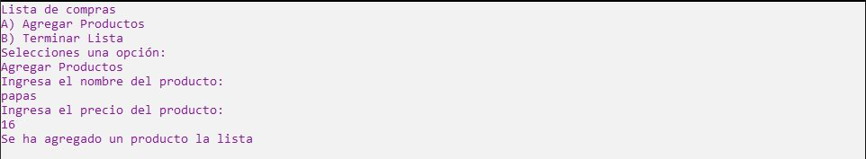
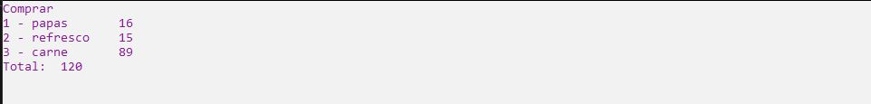

# Ejercicio 12

Una persona se dirige al BecarioMart a realizar sus compras semanales. Dicha persona no sabe
cuántos productos va a comprar y tampoco sabe su valor. Para poder ayudarlo deberás de
implementar dos Listas. Una contiene los nombres de los productos y otro contiene los precios de los productos. Tanto el nombre como el precio, deberán ser ingresados por el usuario y en
seguida, deberán de ser agregados a las listas. Al momento de pagar le aparece una lista de
todos los productos que ha llevado con su respectivo precio, sin embargo, se da cuenta de
que sólo tiene $500:00, por lo que, si ha excedido su cuenta, deberá elegir unos productos y
dejar otros. Para lograr eso, debe poder acceder al índice del producto y así poder elegirlo para
eliminarlo de su lista, hasta que nalmente la cuenta sea menor o igual a los $500:00.
El programa debe preguntar al usuario si desea agregar un producto a su lista, si es así deberá
ingresar tanto el nombre como el precio a las Listas. En caso de que ya no quiera agregar más
productos, le aparecerá en pantalla la lista de todos los productos que ha llevado (nombre y
precio) así como la suma de los precios. Cuando aparezca la lista, deberá tener dos opciones:
Comprar.
Dejar productos.
Para la primera opción deberás de tener validaciones para ver si el dinero que tiene es suciente. Si el dinero es suciente, deberá imprimir un mensaje que diga "Gracias por su compra!",
en caso contrario debe mandarlo a la opción "Dejar productos". Si el usuario elige la opción 2
deberá poder ver los índices de los productos en las listas para así poder decidir cuál eliminar.
Una vez eliminados los productos, debes imprimir de nuevo la lista de productos a comprar
con su precio y darle a elegir de nuevo entre las dos opciones.

Ejecución
--------------

