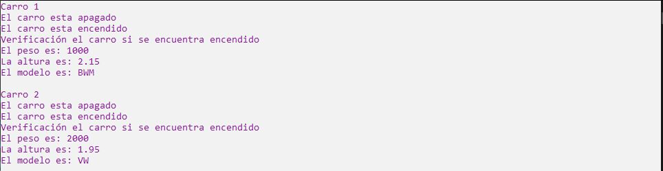

# Ejercicio 13

Se tendrá una clase llamada Carro que tendrá de atributos peso y altura junto con un atributo
llamado " encendido" de tipo booleano inicilizado en false. En el constructor deberás indicarle
los valores peso y altura. La misma clase contará con los métodos encender y apagar, que cambiarán el estado del atributo " encendido" y desplegarás un mensaje indicando si se encendió
o se apagó.
Crear métodos get para poder obtener su peso y altura.
Se contará con un método llamado " Estado"para vericar si el auto se encuentra encendido o no.
El último método de la clase, es toString() el cual nos servirá para imprimir un mensaje,
este mensaje deberá indicar el peso y altura del Carro.
Crear dos clases más que hereden de Carro, con nombres como CarroBWM, CarroVW, etc. Esta
clase tendrá un atributo llamado modelo. Implementa su constructor y también implementa
su método toString() para que pueda imprimir todos sus atributos. En una clase de prueba(en
el método Main), crea objetos de las dos clases hijas y manda a llamar todos sus métodos.

Ejecución
------------------

