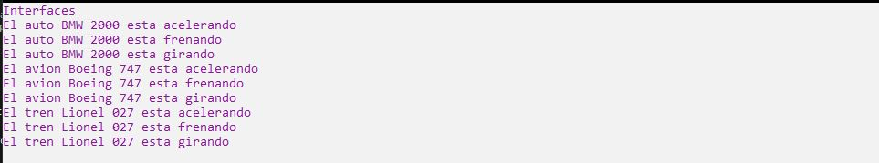

# Ejercicio 14

Implementa una interfaz con los métodos que tú desees. Crearás 3 clases diferentes que puedan
hacer uso de esta interfaz, así como una clase de prueba donde podrás probar su uso. Incluir
en comentarios cuál es el objetivo de la interfaz.

Ejecución
-------------

