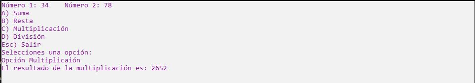

# Ejercicio 15

Crea una calculadora que haga operaciones entre dos números. Las operaciones que deberá
soportar serán suma, resta, multiplicación y división. El programa debe de contener un menú
que me permita elegir cualquier opción y la última de ellas debe ser para salir. Si se termina
una operación debo de volver al menú de inicio. No debe haber forma de salirse del programa a
menos que sea con la opción salir. Considerar todas las excepciones posibles e implementarlas
para evitar errores en tiempo de ejecución. Considera: División entre cero, números demasiado
grandes, cadenas en vez de números, entre otras que a ti se te puedan ocurrir.

Ejecución
---------------

