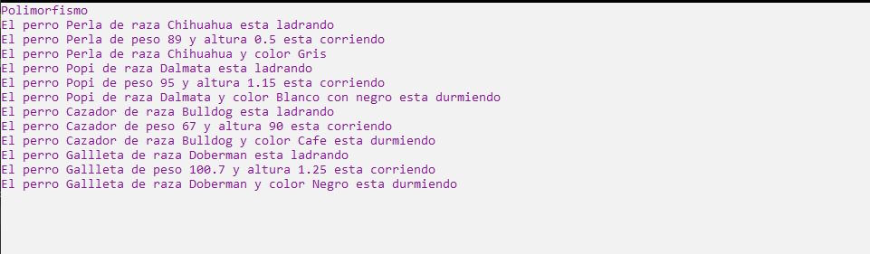

# Ejercicio 16

Realiza un programa que haga un claro ejemplo de Polimorsmo, estas clases pueden ser de
tu elección. Recuerda que polimorfismo no necesariamente es hacer una interfaz o hacer una
clase abstracta.

Ejecución
----------------

