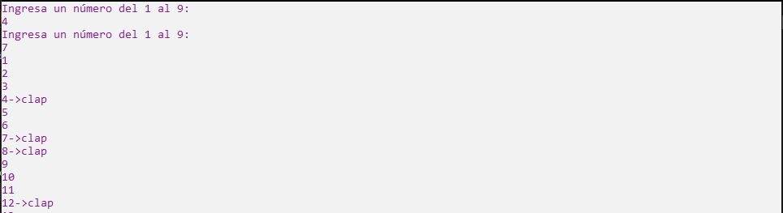

# Ejercicio 2

Realizar un programa en el que se le pida al usuario dos números del 1 al 9, num1 y num2.
Después va a imprimir todos los números naturales del 1 al 100, sin embargo, cuando un
número sea múltiplo de num1 o num2 o contenga alguno de estos números, va a imprimir
‘clap’.

Ejecución
------------

