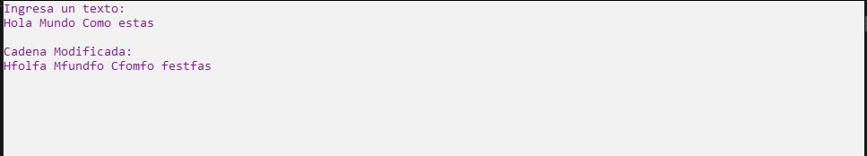

# Ejercicio 3

Escribir un programa que pida al usuario una cadena de texto e imprima la misma cadena de
texto, pero antes de cada vocal, agregue una f.

***Ejemplo:***

"Mi nombre es Ana"

"Mfi nfombrfe fes fAnfa"

Ejecución
-----------------

