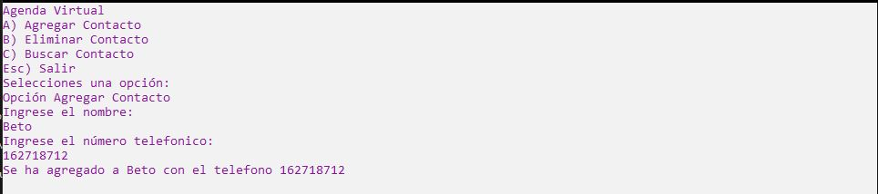

# Ejercicio 5

Se debe simular una agenda telefónica. Cuando inicie el programa se debe desplegar un menú
con las opciones:
* Agregar contacto
* Eliminar contacto
* Mostrar contacto
* Salir

Los contactos van a ser almacenados en un diccionario (investiguen la colección Dictionary)
en donde las llaves son los nombres de los contactos y sus valores van a ser los teléfonos.

Hacer pruebas en en el método Main

Ejecución
-----------------

