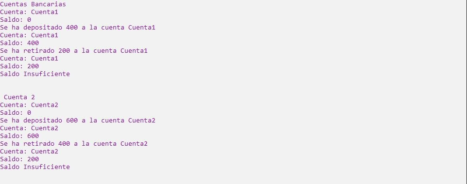

# Ejercicio 6

Se debe diseñar una clase CuentaBancaria que va a tener los métodos mostrarInformación,
depósito y retiro, como atributos, cada objeto va a tener un saldo y un nombre. El método
mostrar información va a imprimir el nombre de la cuenta y el saldo, el método depósito va
a agregar una cantidad al saldo de la cuenta y va a mostrar información. El método retiro va
a retirar dinero de la cuenta, pero antes tendrá que comprobar que se cuente con el dinero
suciente, terminando el retiro va a mostrar información. Cada vez que se cree un objeto,
va a mostrar información de la cuenta. Se debe crear dos objetos y llamar sus métodos para
probarlos.

Ejecución
----------------

