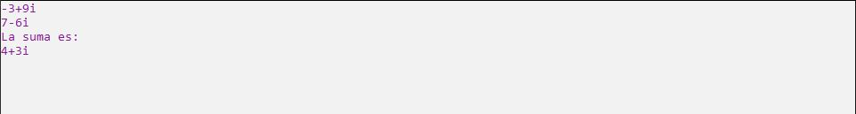

# Ejercicio 7

Se debe diseñar una clase NumeroComplejo, que va a tener como atributos parteReal y parteImaginaria, se debe denir un método imprimir que va a imprimir el número complejo con
formato. Se debe denir un método para la suma de dos objetos de la clase NumeroComplejo
que retorne un nuevo número complejo que sea la suma de los otros dos. A continuación se
debe crear dos números complejos y probar sus métodos.

Ejecución
----------------

