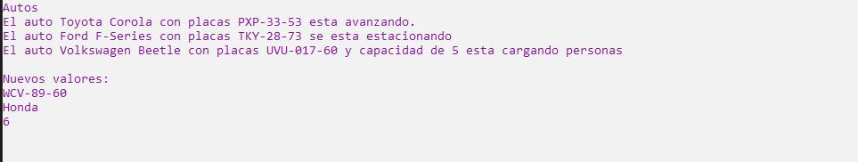

# Ejercicio 8

Crear una clase llamada Auto que contenga los siguientes elementos:
* Al menos 3 atributos de diferentes tipos.
* Constructor por defecto y sobrecarga de constructor.
* Métodos getters y setters para encapsulamiento.
* 3 métodos que pueda realizar un automóvil.

Instanciar 3 objetos y con ellos mandar a llamar a cada uno de los métodos realizados (Hacer
uso también de los métodos set para poder cambiar alguno de sus atributos y de los métodos
get para poder imprimir sus datos).

Ejecución
------------

