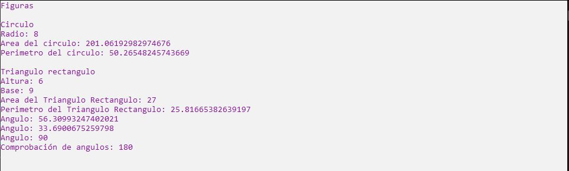

# Ejercicio 9

Haz una pequeña investigación sobre los métodos que se encuentran en la clase Math y para
qué sirven. Crea una clase llamada Cículo y otra con el nombre de la figura geométrica de tu
preferencia. Cada clase deberá tener sus respectivos atributos y métodos de tal manera que
ocupes mínimo tres métodos de la clase Math.

***Nota:*** la investigación se puede incluir como comentario en su archivo.

Ejecución
-------------

